# ⛏️ MineHub.ai

> **AI-Powered Geological, Mining & Statutory Reporting Intelligence Platform**  
> *Transforming 50+ years of fragmented CMPDI & Coal India archives into instant, evidence-grounded intelligence.*

---

## 📛 Project Info

| Attribute | Details |
| :--- | :--- |
| **Hackathon** | Smart India Hackathon 2026 |
| **Problem Statement ID** | 26023 |
| **Problem Statement** | AI-Powered Geological, Mining and other Reporting Solution for CMPDI/CIL subsidiaries |
| **Theme** | Smart Automation |
| **Category** | Software |
| **Team Name** | Pehchan 302 |
| **Team ID** | 163089 |
| **Organization** | Ministry of Coal / CMPDI / Coal India Limited (CIL) |

---

## 🎯 Problem

* **50+ Years of Siloed Data**: Decades of critical geological reports, borehole lithology logs, and mine ledgers trapped in scanned PDFs, degraded paper, and regional archives.
* **Subsidiary Fragmentation**: Data partitioned across 7 operating subsidiaries (ECL, BCCL, CCL, WCL, SECL, MCL, NCL) and CMPDI Regional Institutes with no unified search.
* **Manual Bottleneck**: Geologists and officers spend days manually searching for seam thickness, stripping ratios, ash %, and statutory environmental clearances.
* **Hallucination Risk**: Standard AI models cannot be trusted with critical mining engineering decisions without strict page-level verification.

---

## 🏗 Solution

MineHub.ai unifies fragmented mining archives into an evidence-oriented intelligence workflow:

```text
Official Archives & PDFs ──► Layout OCR & Extraction ──► Deep-Dig RAG ──► Zero Guess Gate ──► Multi-Agent Bench ──► Traceable Studio Output
```

* **Centralized Intelligence**: Instant cross-subsidiary exploration and production query resolution.
* **Strict Provenance**: Every generated insight binds directly to document IDs and verified page excerpts.
* **Interactive Workbench**: 8 specialized analytical tools generating reports, mind maps, data tables, charts, and timelines.

---

## 🔑 Key Features

* **MineHub Report Studio**: Interactive analytical workbench with active source management and 8 specialized output tools.
* **Deep-Dig RAG**: Stratigraphy-aware retrieval indexing complex borehole profiles and multi-column chemical tables.
* **Zero Guess Gate**: Automated validation gate requiring citation proof before asserting facts, deterring hallucination.
* **Coal-Tuned Brain**: Domain-adapted reasoning engine tailored for Indian coalfield stratigraphy and seam taxonomy.
* **Transfer Superior Memory (MAG)**: Reusable memory layer preserving institutional knowledge across personnel transitions.
* **GeoMap**: Geospatial intelligence framework linking geological records to colliery and block coordinates.
* **Agent Bench**: Governed environment orchestrating specialized personas (Geology, Operations, Compliance).
* **Workflow Orchestration**: Automated end-to-end pipeline from raw document ingestion to executive brief delivery.

---

## 🧩 Architecture

```text
┌────────────────────────────────────────────────────────────────────────────────────────┐
│                                   PRESENTATION LAYER                                   │
│    React 18 SPA • Custom Industrial CSS System • Report Studio • PDF Viewer Modal      │
└───────────────────────────────────────────┬────────────────────────────────────────────┘
                                            │
┌───────────────────────────────────────────▼────────────────────────────────────────────┐
│                             AGENT BENCH & ORCHESTRATION                                │
│   Geology Specialist  •  Operations Analyst  •  Statutory Auditor  •  Synthesizer      │
└───────────────────────────────────────────┬────────────────────────────────────────────┘
                                            │
┌───────────────────────────────────────────▼────────────────────────────────────────────┐
│                        RETRIEVAL & ZERO-GUESS VERIFICATION                             │
│   Deep-Dig Hybrid Search (Dense Vectors + BM25)  •  Citation Provenance Validator      │
└───────────────────────────────────────────┬────────────────────────────────────────────┘
                                            │
┌───────────────────────────────────────────▼────────────────────────────────────────────┐
│                                 DATA SOURCES & STORAGE                                 │
│   CMPDI Geological Reports • CIL Ledgers • data.gov.in • coal.gov.in • Bhuvan GIS      │
└────────────────────────────────────────────────────────────────────────────────────────┘
```

---

## 🏗 Systematic Work Flow

1. **Document Intake**: Ingests multi-subsidiary geological investigation reports, borehole logs, or statutory ledgers.
2. **Layout Parsing**: Extracts lithological columns, proximate analysis tables, and statutory clauses intact.
3. **Domain Indexing**: Chunks data by stratigraphic seam units and indexes into hybrid vector/metadata stores.
4. **Deep-Dig Retrieval**: Executes hybrid semantic and keyword search across user-selected active source dossiers.
5. **Zero-Guess Gate Validation**: Matches every assertion against exact document source IDs, page numbers, and text spans.
6. **Analytical Synthesis**: Transforms validated findings into user-requested deliverables (Report, Mind Map, Table, Timeline).
7. **Provenance Inspection**: Officer inspects supporting page excerpts directly within the Evidence Drawer.

---

## 📂 Example Work Flow

* **Scenario**: Senior Geologist needs to correlate borehole depths and coal quality for Seam IX/X in Talcher Basin.
* **Execution**:
  1. Selects active dossiers: `CMPDI Borehole Exploration Core Log` & `CIL Subsidiary Production Ledger`.
  2. Queries: *"What is the verified core drilling depth and ash content for Seam IX?"*
  3. Deep-Dig RAG retrieves exact borehole intercepts (`CMPDI-BH-89` at 420.5 m, 98.2% core recovery).
  4. Zero-Guess Gate validates text against source document pages and generates citations `[CMPDI-BH-89]`.
  5. Report Studio outputs an interactive **Mind Map**, **Data Table**, and exportable **Executive Dossier** in seconds.

---

## ⚙️ What We Built + How to Run It

### Prerequisites
* **Node.js**: `v18.0.0+`
* **npm**: `v9.0.0+`

### Installation & Local Run
```bash
# 1. Navigate to application
cd MineApp

# 2. Install dependencies
npm install

# 3. Start local development server
npm run dev
```
> Application opens locally at: **`http://localhost:5174/`**

### Build for Production
```bash
npm run build
```
> Compiles optimized static assets to `MineApp/dist/`.

---

## 🛠 Tech Stack

* **Frontend**: React 18, Vite 5, Recharts, Styled-Components, Lucide Icons, Canvas-Confetti
* **Design System**: Handcrafted Vanilla CSS with industrial theme tokens (Tailwind-Free)
* **Cloud Hosting**: Zoho Catalyst Slate CLI
* **AI Configuration**: Google AI Studio

---

## 📚 Data Sources

| Source | Authority | Scope |
| :--- | :--- | :--- |
| **data.gov.in** | Open Government Data Platform India | All-India coal production by subsidiary and grade |
| **coal.gov.in** | Ministry of Coal | Provisional statistics, annual reports, statutory notifications |
| **coalindia.in** | Coal India Limited | Subsidiary production ledgers, ESG & CSR reports |
| **cmpdi.co.in** | CMPDI | Exploration geological reports, borehole lithology logs |
| **bhuvan.nrsc.gov.in** | ISRO / NRSC | Geospatial satellite mine boundaries and land use data |

---

## 🚀 Deployment Links

* **Live Cloud Application**: [https://minehub-geo-ai.onslate.in](https://minehub-geo-ai.onslate.in)
* **GitHub Repository**: [https://github.com/akash14102006/Pehchan-302-MineHub.ai](https://github.com/akash14102006/Pehchan-302-MineHub.ai)

---

## 📸 Snapshots

<table>
  <tr>
    <td width="50%">
      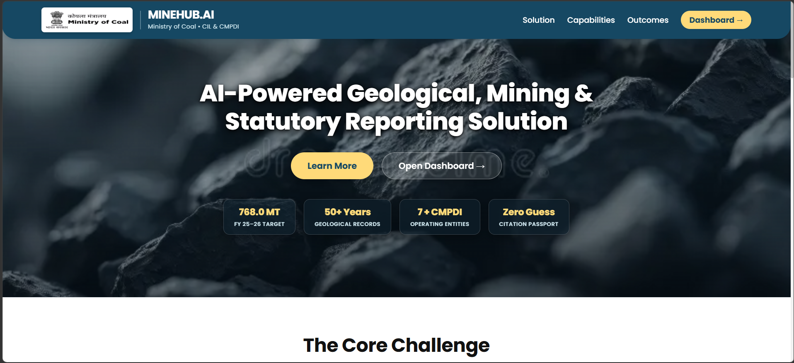
      <p align="center"><b>Landing Portal & National Mandate Metrics</b></p>
    </td>
    <td width="50%">
      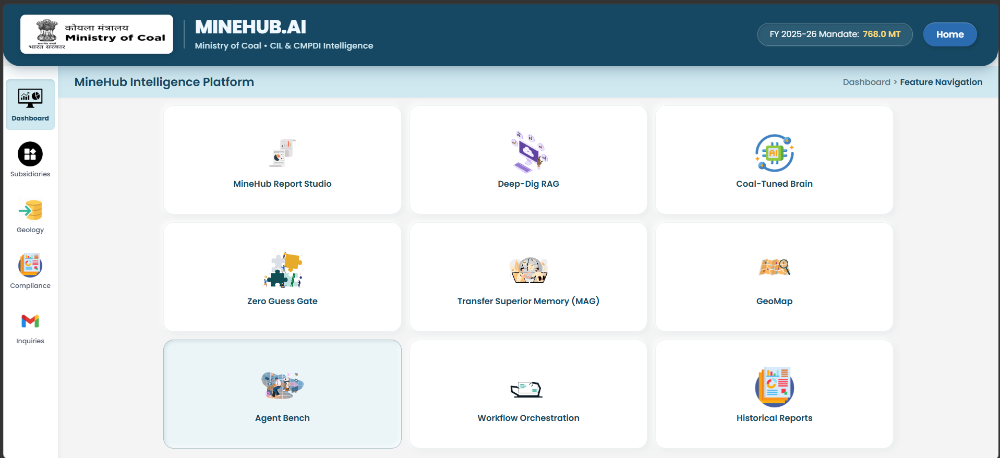
      <p align="center"><b>Platform Feature Navigation Hub</b></p>
    </td>
  </tr>
  <tr>
    <td width="50%">
      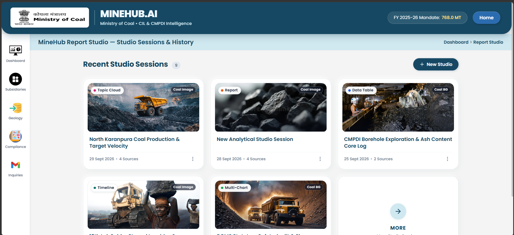
      <p align="center"><b>Studio Sessions & History Vault</b></p>
    </td>
    <td width="50%">
      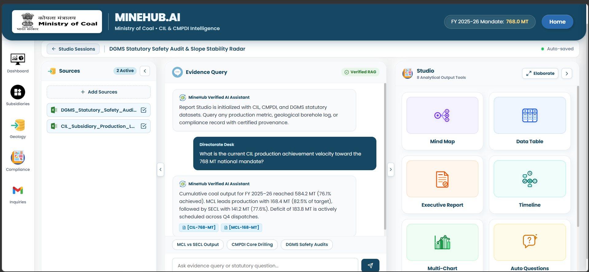
      <p align="center"><b>Report Studio & Zero-Guess Evidence Query</b></p>
    </td>
  </tr>
</table>

---

## 🖥️ Deployment Details:

<table>
  <tr>
    <td width="50%">
      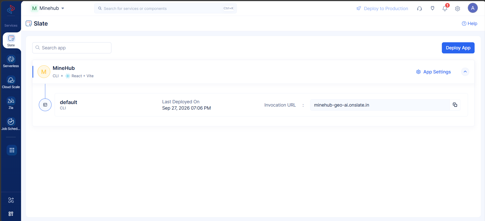
      <p align="center"><b>Zoho Catalyst Slate Cloud Console (Live Deployment: minehub-geo-ai.onslate.in)</b></p>
    </td>
    <td width="50%">
      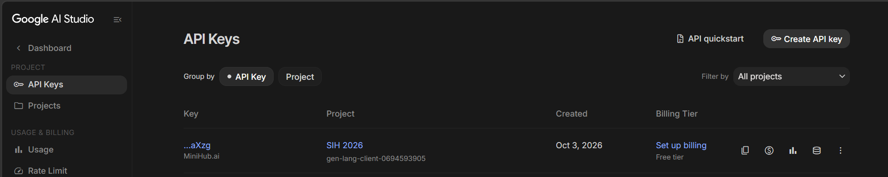
      <p align="center"><b>Google AI Studio API Keys Console (SIH 2026 / MiniHub.ai)</b></p>
    </td>
  </tr>
</table>

---

## 🖥️ Prototype:

<table>
  <tr>
    <td width="50%">
      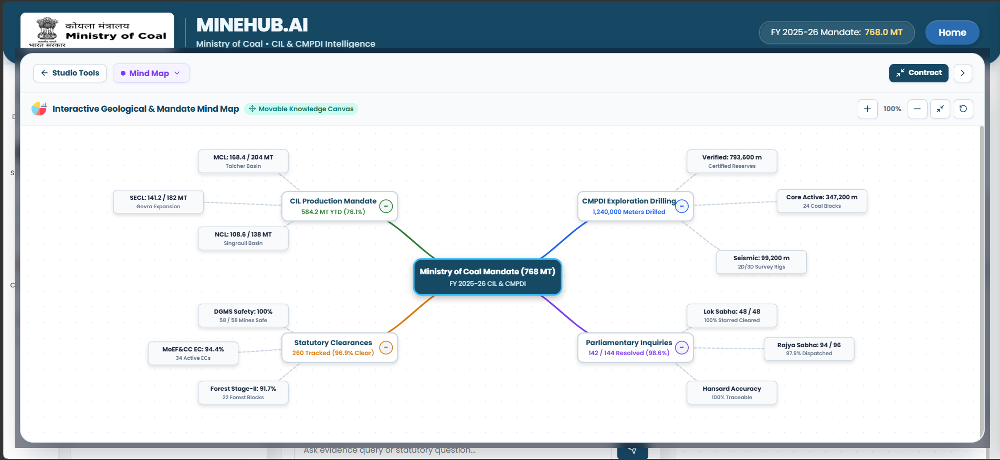
      <p align="center"><b>Interactive Geological & Mandate Mind Map</b></p>
    </td>
    <td width="50%">
      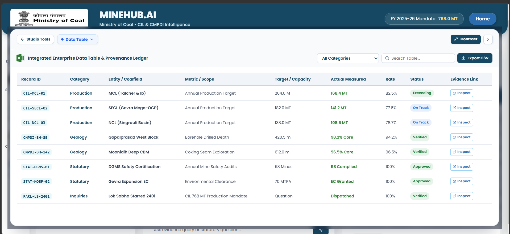
      <p align="center"><b>Enterprise Data Table & Provenance Ledger</b></p>
    </td>
  </tr>
  <tr>
    <td width="50%">
      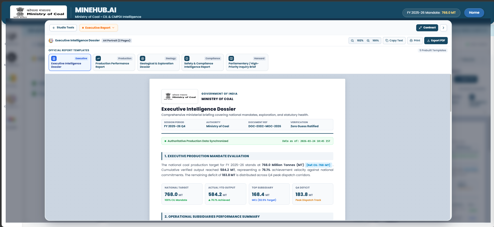
      <p align="center"><b>Executive Intelligence Dossier (PDF Exportable)</b></p>
    </td>
    <td width="50%">
      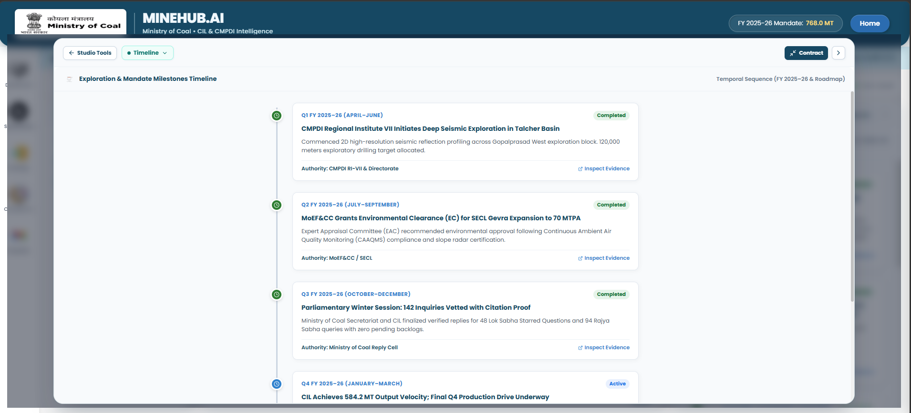
      <p align="center"><b>Exploration & Mandate Milestones Timeline</b></p>
    </td>
  </tr>
  <tr>
    <td width="50%">
      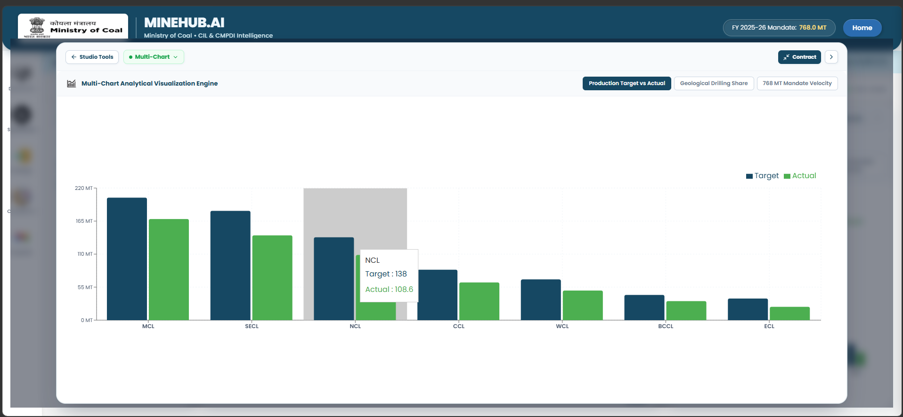
      <p align="center"><b>Multi-Chart Analytical Visualization Engine</b></p>
    </td>
    <td width="50%">
      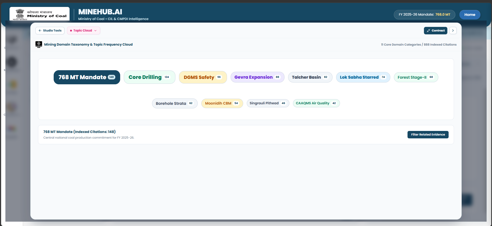
      <p align="center"><b>Domain Taxonomy & Topic Frequency Cloud</b></p>
    </td>
  </tr>
  <tr>
    <td colspan="2" align="center">
      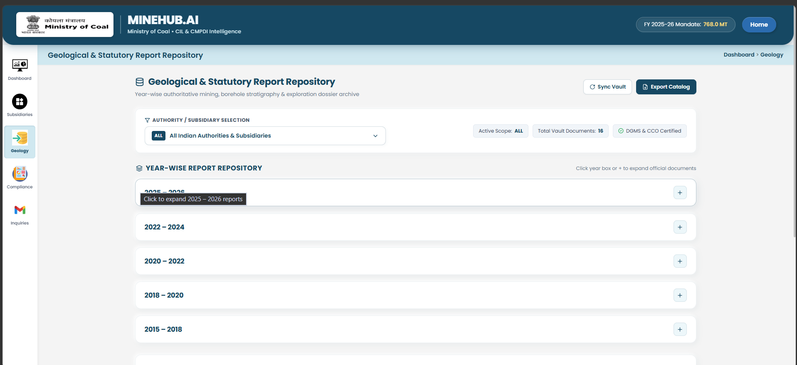
      <p align="center"><b>Authoritative Geological & Statutory Report Archive</b></p>
    </td>
  </tr>
</table>

---

## 🔮 Future Advancements

* **Autonomous Agent Bench**: LangGraph runtime for collaborative multi-agent cross-examination.
* **50-Year Document OCR Pipeline**: Table-aware layout parsing for degraded physical borehole charts.
* **Neo4j Geological Knowledge Graph**: Entity-relationship mapping linking seams, faults, and leases.
* **Field Pilot at CMPDI RI-1**: On-premises validation with exploration geologists at Asansol.

---

## 📊 Impact

* **Ministry Officials**: Direct access to verified figures for Parliamentary questions and national mandate reviews.
* **CMPDI Geologists**: Drastically reduced turnaround time in synthesizing decades of historical borehole logs.
* **CIL Subsidiaries**: Seamless cross-subsidiary stripping ratio and production variance benchmarking.

---

## 📁 Repository Structure

```text
MineHub/
├── MineApp/                 # Production Frontend Application (React 18 + Vite)
│   ├── public/              # Runtime public assets (coal images, lotties, icons)
│   ├── src/                 # Application source code
│   │   ├── components/      # UI components (Studio, Geology, Dashboard, Landing)
│   │   ├── pages/           # Application views (Studio, Geology, Dashboard, Landing)
│   │   ├── services/        # Client data providers & mock services
│   │   ├── styles/          # Custom industrial CSS design system (Tailwind-free)
│   │   └── constants/       # Feature definitions & navigation routes
│   ├── package.json         # Dependencies & npm scripts
│   ├── vite.config.js       # Vite bundler config
│   └── catalyst.json        # Zoho Catalyst Slate deployment config
│
├── Logo/                    # Official brand assets (cillogo-full.png, logo.png)
├── Readme/                  # Deployment & prototype visual assets
│   ├── Prototype/           # Real prototype screenshot gallery (11 screens)
│   ├── catalyst_slate_deployment.png
│   └── google_ai_studio_api.png
│
├── .gitignore               # Git exclusion rules
└── README.md                # Project flagship documentation
```

---

## 👥 Team

**Team Pehchan 302**  
*Smart India Hackathon 2026 &bull; Problem Statement ID: 26023*  
Ministry of Coal &bull; Central Mine Planning & Design Institute (CMPDI) &bull; Coal India Limited (CIL)
